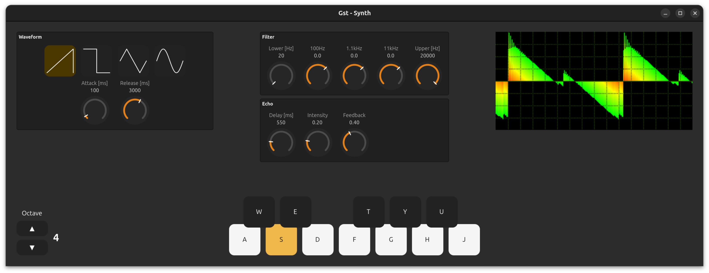

# gst-synth

A real-time software synthesizer built on [GStreamer](https://gstreamer.freedesktop.org/) and [GTK4](https://gtk.org/), written in Rust.


---

## Features

The synthesizer provides multiple waveforms (Sine, Square, Sawtooth, Triangle), octaves and effects (echo, filters). The notes can be played via (computer) keyboard. The generated audio is outputted via speakers and visualized. 



---

## Keybindings

### Notes

| Key | Note |
|-----|------|
| `A` | C    |
| `W` | C#   |
| `S` | D    |
| `E` | D#   |
| `D` | E    |
| `F` | F    |
| `T` | F#   |
| `G` | G    |
| `Y` / `Z` | G# |
| `H` | A    |
| `U` | A#   |
| `J` | B    |

### Settings

| Key | Waveform  |
|-----|-----------|
| `V` | Sawtooth  |
| `B` | Square    |
| `N` | Triangle  |
| `M` | Sine      |
| `1` | Octave 1  |
| ... |     |
| `7` | Octave 7  |
| `Q` | Quit   |

---

## Building the project

### Prerequisites

Install Rust via [rustup](https://rustup.rs/):

```sh
curl --proto '=https' --tlsv1.2 -sSf https://sh.rustup.rs | sh
```

Install GStreamer and GTK4 development libraries:

**Debian / Ubuntu**
```sh
sudo apt install \
  libgstreamer1.0-dev \
  libgstreamer-plugins-base1.0-dev \
  gstreamer1.0-plugins-good \
  gstreamer1.0-plugins-bad \
  libgtk-4-dev
```

**Fedora**
```sh
sudo dnf install \
  gstreamer1-devel \
  gstreamer1-plugins-base-devel \
  gstreamer1-plugins-good \
  gstreamer1-plugins-bad-free \
  gtk4-devel
```

**Arch Linux**
```sh
sudo pacman -S gstreamer gst-plugins-base gst-plugins-good gst-plugins-bad gtk4
```

### Run

```sh
cargo run --release
```

---

## Contributing to the project

Contributions are welcome. If you find a bug or want to add a feature, feel free to open an issue or a pull request.

Ideas to inspire you:

- **New audio effects** 
  - E.g. compressor, reverb, ... 
  - Effect drop-down list (letting effects being switched at runtime)
- **Midi Support**
  - Currently the synthesizer can only be played with computer keyboards/mouses. I'm planning to add Midi keyboard support myself but don't know when I will find time for it.
- **Portability** 
  - Currently the project only runs on Linux (mostly due to its dependencies). However, it would be cool to run it on other platforms as well.

Thanks in advance!